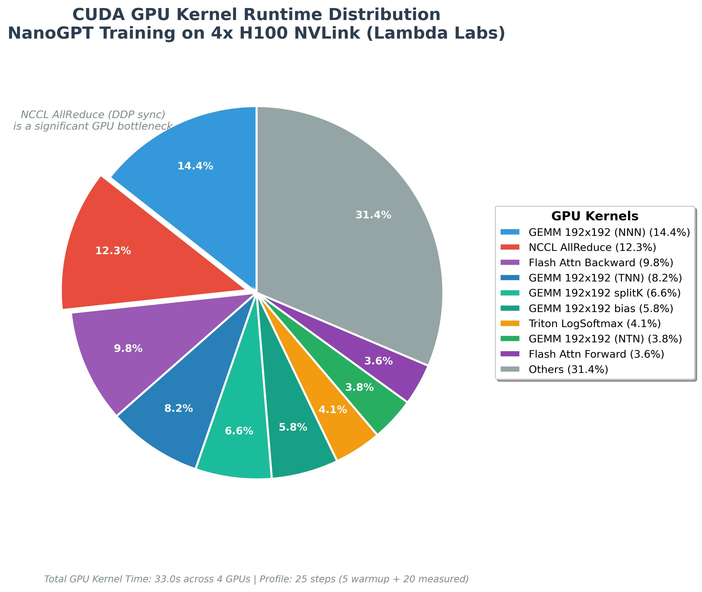
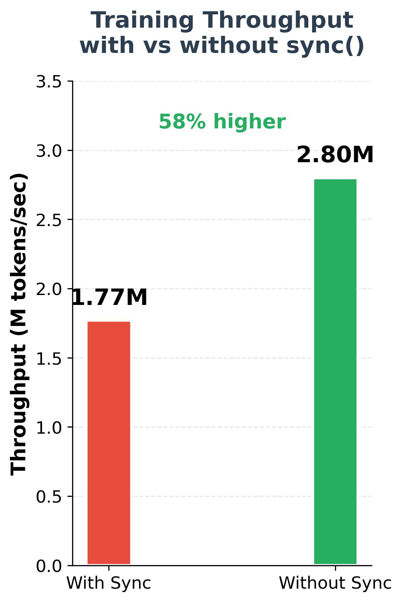
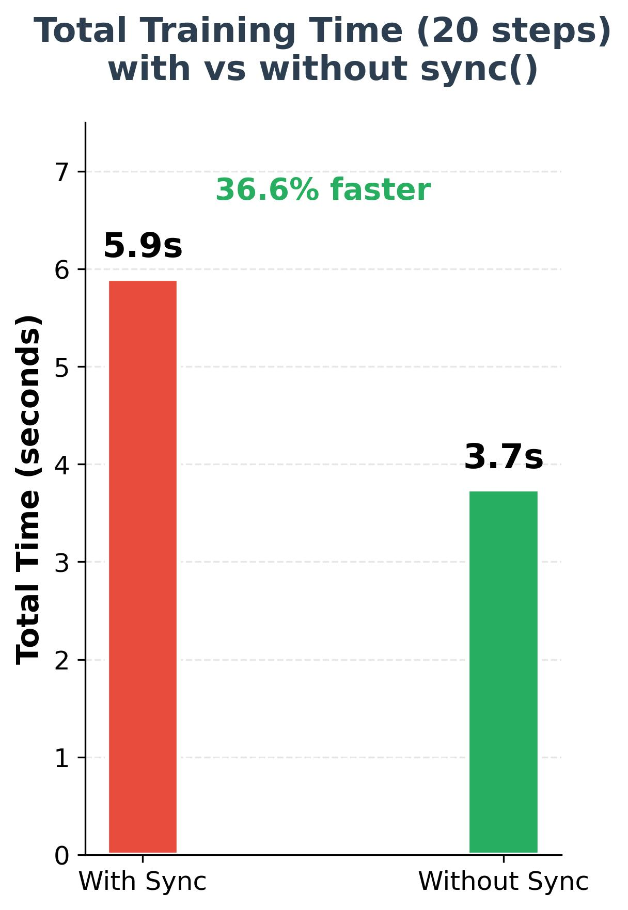

# Profiling Andrej Karpathy's NanoGPT(Build-NanoGPT)

## Introduction

This project aims to profile Andrej Karpathy's NanoGPT 🚀. I have re-implemented his original work here to analyze the performance characteristics of the training pipeline using NVIDIA Nsight Systems and NVIDIA Nsight Compute.

## Modifications from the Original NanoGPT

- Separated eval and train models to enable `torch.compile()` for training while using uncompiled model for evaluation/generation ([dynamic sequence lengths cause recompilation](https://docs.pytorch.org/docs/main/user_guide/torch_compiler/compile/dynamic_shapes_core_concepts.html#dynamic-behavior-overview))
- Added inference module (`infer.py`) for standalone text generation
- Fixed checkpoint loading for PyTorch 2.6+ compatibility
- Added checkpoint resume support to continue training from saved state

## Environment

- **GPU:** 4x NVIDIA H100 NVLink (94GB per GPU)
- **PyTorch:** 2.8.0
- **CUDA:** 12.8.1

## NSys Profiling Results

Profiled NanoGPT training with NVTX markers using `nsys profile`. Configuration:
- **Warmup steps:** 5
- **Profile steps:** 20
- **Batch size:** 524,288 tokens (2 micro-steps × 64 batch × 1024 seq × 4 GPUs)

### GPU Kernel Time Distribution

<table>
<tr>
<td></td>
<td valign="top">

**Key findings:**
- **GEMM kernels (~43%)** - Matrix multiplications using optimized cuBLAS nvjet kernels
- **NCCL AllReduce (12.3%)** - DDP gradient synchronization
- **Flash Attention (13.4%)** - Forward (3.6%) + Backward (9.8%)
- **Triton kernels** - Fused operations (layer norm, softmax, GELU, etc.)

</td>
</tr>
</table>

### Training Step Timeline

```
Timeline for one training step (~295ms):

CPU Timeline:
  0ms          50ms        100ms        150ms        200ms        295ms
  |-------------|------------|------------|------------|------------|
  [micro_step_0: fwd+bwd]
                [micro_step_1: fwd+bwd ~158ms]
                                          [all_reduce CPU call]
                                          [clip_grad + optimizer ~11ms]
                                                      |
                                                      sync waits here ──┐
                                                                        │
GPU Timeline:                                                           │
  |-------------|------------|------------|------------|------------|   │
  [  forward + backward kernels  ]                                      │
                                          [===AllReduce===]─────────────┘
```

**Breakdown:**

| Phase | Time | Description |
|-------|------|-------------|
| micro_step_0 | ~100ms | Forward + backward (no gradient sync) |
| micro_step_1 | ~158ms | Forward + backward (triggers DDP AllReduce) |
| AllReduce (CPU) | <1ms | CPU launches NCCL AllReduce (async) |
| AllReduce (GPU) | ~40ms | Actual GPU execution (12.3% of kernel time) |
| clip_grad + optimizer | ~11ms | Runs in parallel with GPU AllReduce |
| torch.cuda.synchronize() | **sync wait** | CPU waits for GPU to finish |

### Sync Overhead Analysis

The CUDA API time is dominated by synchronization:

| API Call | % of CUDA API Time | Issue |
|----------|-------------------|-------|
| `cudaStreamSynchronize` | 41.8% | Stream synchronization |
| `cudaDeviceSynchronize` | 39.8% | Explicit sync in training loop |
| `cudaLaunchKernel` | 8.6% | Kernel launches (expected) |
| **Total sync overhead** | **81.6%** | Blocking CPU-GPU overlap |

### Optimization Opportunity

Removing `torch.cuda.synchronize()` could enable CPU-GPU pipelining:

```
Current (with sync):
Step 1: [CPU work][██WAIT██]
        [====GPU 295ms=====]
        |<──── 295ms ─────>|

Without sync (pipelined):
Step 1: [CPU work]
        [====GPU====]
Step 2:      [CPU work]
             [====GPU====]
        |<── ~265ms? ──>|
```

**Current throughput:** `524,288 tokens / 0.295s ≈ 1.77M tokens/sec`

### Actual Results: Sync Removed

After removing `torch.cuda.synchronize()`, the actual improvement was **much better than expected**:

<table>
<tr>
<td></td>
<td></td>
<td></td>
</tr>
</table>

| Metric | With Sync | Without Sync | Improvement |
|--------|-----------|--------------|-------------|
| **Step time** | 295ms | 187ms | **36.6% faster** |
| **Throughput** | 1.77M tok/sec | 2.80M tok/sec | **58% higher** |
| **Total time (20 steps)** | 5.9s | 3.74s | **36.6% faster** |

---

## Bonus: Cloud Provider Comparison (RunPod vs Lambda)

We ran identical profiling on two cloud providers with the same GPU configuration (4x H100 NVLink). The results were surprisingly different(ran with the torch.cuda.synchronize()):

### Performance Comparison

| Metric | RunPod | Lambda Labs | Difference |
|--------|--------|-------------|------------|
| **Steady-state** | ~525ms/step | ~295ms/step | **1.78x faster** |
| **Throughput** | ~1.0M tok/sec | ~1.77M tok/sec | **1.77x higher** |
| **Compile time (step_0)** | ~9.7s | ~6.3s | 1.5x faster |

### GPU Kernel Distribution

| Kernel | RunPod | Lambda Labs |
|--------|--------|-------------|
| NCCL AllReduce | **23.8%** | **12.3%** |
| GEMM (total) | ~35% | ~43% |
| Flash Attn Backward | 10.2% | 9.8% |
| Flash Attn Forward | 3.1% | 3.6% |

### CUDA API Sync Overhead

| API | RunPod | Lambda Labs |
|-----|--------|-------------|
| cudaDeviceSynchronize | 45.3% | 39.8% |
| cudaStreamSynchronize | 35.4% | 41.8% |
| **Total sync overhead** | **80.7%** | **81.6%** |

### Key Observations

1. **NCCL AllReduce is 2x lower %** on Lambda (12.3% vs 23.8%) - suggests faster NVLink or better NCCL configuration
2. **GEMM kernels dominate** on Lambda (43% vs 35%) - because communication is faster, compute becomes a larger fraction
3. **Sync overhead % is similar** (~81%) - both have the `torch.cuda.synchronize()` bottleneck
4. **Absolute time is much faster** - Lambda completes steps in 295ms vs 525ms
